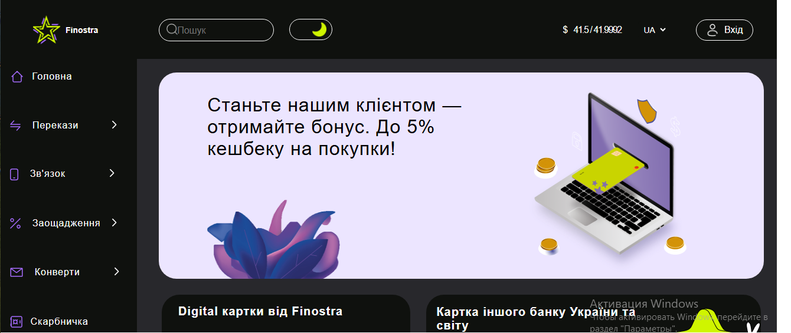

# 🎓 Finostra (Фронтенд дипломного проєкту)

Цей репозиторій містить **фронтенд-частину дипломного проєкту** Finostra — вебзастосунку, розробленого командою студентів. Проєкт створено на React.js з використанням сучасних інструментів управління станом та компонентного підходу.

## 👥 Команда

- 🎨 **UI/UX-дизайн** — розроблений у Figma нашою дизайнерською групою
- ⚙️ **Бекенд** — реалізований на **Java**
- 💻 **Фронтенд** — розроблявся мною разом із напарником на **React.js**

## 🧰 Використані технології

- React.js (функціональні компоненти)
- CSS-модулі (module.css)
- Redux Toolkit
- React hooks: `useState`, `useEffect`, `useContext`, `useDispatch`
- JavaScript ES6+

## 🖥️ Масштабованість інтерфейсу

Хоча проєкт не має адаптивної верстки в класичному розумінні (без media-запитів), усі стилі написані з використанням відносних одиниць (`em`, `vw`, `vh`). Це забезпечує коректне відображення інтерфейсу на різних розмірах екранів — як на великих моніторах, так і на ноутбуках.


## 📸 Скриншот


## 🚀 Швидкий старт

```bash
# Клонування репозиторію
git clone https://github.com/ViktoriaGavrilenko/Finostra_front_diploma.git

# Перехід у папку з фронтендом
cd Finostra_front_diploma/finostrafrontend

# Встановлення залежностей
npm install

# Запуск застосунку
npm start